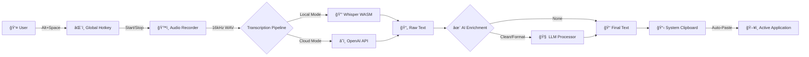

# Voice Intelligence

> **Voice-to-text that just works.** Speak anywhere, paste everywhere.
> 
> *Desktop voice capture and AI-powered transcription for macOS.*


## ✨ Features

- 🎙️ **Push-to-Talk**: Global hotkey (default `Alt+Space`) to record instantly from any app.
- 🔒 **Local Privacy**: Transcribe offline using WebAssembly-powered Whisper (zero data leaves your device).
- ☁️ **Cloud Accuracy**: Optional OpenAI Whisper API integration for highest accuracy.
- 🧠 **AI Enrichment**: Use OpenAI to clean, format, summarize, or extract action items.
- 📋 **Auto-Paste**: Transcription is automatically pasted into your active text field.
- ⚙️ **Customizable**: Change hotkeys, language, and enrichment settings via the menu bar widget or app settings.
- 🖥️ **Menu Bar**: Unobtrusive menu bar widget for quick mode switching.


## 🚀 Quick Start

1. **Download** the latest release (`.dmg`) and drag to Applications.
2. **Launch** the app.
3. **IMPORTANT: Enable Accessibility Permission**
   - The app uses accessibility features to paste text directly into your active application.
   - Go to **System Settings > Privacy & Security > Accessibility**.
   - Toggle **Voice Intelligence** to ON.
   - *Without this, Auto-Paste will not work and you will need to manually copy text.*
   
   

4. **Press** `Alt+Space` (default) to start recording.
5. **Speak** your thought.
6. **Release** keys to stop. The text will appear wherever your cursor is!

## 🏗️ Architecture

Voice Intelligence combines the native capabilities of Electron with the flexibility of Next.js and the power of local AI.



## 🛠️ Tech Stack

- **Electron**: For cross-platform desktop integration and global shortcuts.
- **Next.js (Nextron)**: React-based renderer for a modern, responsive UI.
- **TypeScript**: Strict type safety across main and renderer processes.
- **Whisper**: State-of-the-art speech recognition (Local via Transformers.js, Cloud via OpenAI).
- **LLMs**: GPT-4o-mini for intelligent text enrichment.
- **Vitest**: Unit and integration testing.

## 💡 Design Decisions

### Why Local Whisper?
Privacy is paramount. Using WebAssembly-based Whisper means your voice data never has to leave your machine. It works completely offline and has zero latency overhead from network requests.

### Why Push-to-Talk?
Toggle buttons introduce friction ("Did I start recording?"). Push-to-talk mimics natural speech patterns—press when you speak, release when done. It's faster and less error-prone.

### Why Auto-Paste?
The goal is to reduce friction. Manually copying and pasting breaks flow. Auto-paste makes the app feel like a native extension of your keyboard. THIS REQUIRES ACCESSIBILITY PERMISSION.

## 💻 Development

### Prerequisites
- Node.js 18+
- macOS (for global hotkeys and automation features)

### Setup

```bash
# Clone repository
git clone https://github.com/schauersbergern/voice-intelligence-app.git
cd voice-intelligence-app

# Install dependencies
npm install

# Run in development mode
npm run dev
```

### Testing

```bash
# Run unit and integration tests
npm test
```

### Building

**macOS:**
```bash
# Build for macOS (Universal DMG)
npm run build:mac
```

**Windows:**
```bash
# Build for Windows (NSIS Installer)
npm run build:win
```

## 📂 Project Structure

```
voice-intelligence-app/
├── main/                   # Electron Main Process
│   ├── background.ts       # Entry point
│   ├── whisper-handler.ts  # Transcription logic
│   └── tray.ts             # Menu bar integration
├── renderer/               # Next.js Renderer Process
│   ├── pages/              # UI Pages
│   ├── components/         # React Components
│   └── hooks/              # Custom Hooks (useAudioRecorder)
├── shared/                 # Shared Types & constants
└── tests/                  # Vitest Test Suite
```

## 📄 License

MIT © Voice Intelligence Team
