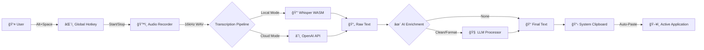

# Voice Intelligence

**Voice-to-text that just works.** Speak anywhere, paste everywhere.

*Desktop voice capture and AI-powered transcription for macOS and Windows.*


## ✨ Features

- 🎙️ **Global Hotkey**: Press `Alt+Space` (default) to toggle recording from any app. (Press & release to start, press & release again to stop).
- 🎤 **Microphone Chooser**: Select your preferred input device from the menu bar or settings.
- 🔒 **Local Privacy**: Transcribe offline using WebAssembly-powered Whisper (zero data leaves your device).
- ☁️ **Cloud Accuracy**: Optional OpenAI Whisper API integration for highest accuracy.
- 🧠 **AI Enrichment**: Use OpenAI to clean, format, summarize, or extract action items.
- 📋 **Auto-Paste**: Transcription is automatically pasted into your active text field.
- ⚙️ **Customizable**: Change hotkeys, language, and enrichment settings via the menu bar widget or app settings.
- 🖥️ **Menu Bar**: Unobtrusive menu bar widget for quick mode switching.


## 🚀 Quick Start

1. **Install the Application**:
   - If you have just built the app (see [Building](#building) below), navigate to the `dist` folder.
   - **Apple Silicon (M1/M2/M3)**: Open `Voice Intelligence-1.0.0-arm64.dmg`.
   - **Intel Mac**: Open `Voice Intelligence-1.0.0.dmg`.
   - Drag the app to your `Applications` folder.
2. **Launch** the app from Applications.
3. **IMPORTANT: Enable Accessibility Permission**
   - The app uses accessibility features to paste text directly into your active application.
   - Go to **System Settings > Privacy & Security > Accessibility**.
   - Toggle **Voice Intelligence** to ON.
   - *Without this, Auto-Paste will not work and you will need to manually copy text.*
   
   

4. **Toggle Recording**:
   - Press and **release** `Alt+Space` (default) to **START** recording.
   - Speak your thought.
   - Press and **release** `Alt+Space` again to **STOP** recording.
   - *Note: This is a toggle, not a hold-to-talk action. You must release the keys to activate.*
5. **Done!** The text will appear wherever your cursor is!

## 🏗️ Architecture

Voice Intelligence combines the native capabilities of Electron with the flexibility of Next.js and the power of local AI.



## 🛠️ Tech Stack

- **Electron**: For cross-platform desktop integration and global shortcuts.
- **Next.js (Nextron)**: React-based renderer for a modern, responsive UI.
- **TypeScript**: Strict type safety across main and renderer processes.
- **Whisper**: State-of-the-art speech recognition (Local via Transformers.js, Cloud via OpenAI).
- **LLMs**: GPT-4o-mini for intelligent text enrichment.
- **Vitest**: Unit and integration testing.

## 💡 Design Decisions

### 🔒 Local Transcription Mechanism

We use **Transformers.js** running directly in the Electron renderer process, utilizing a quantized **Xenova/whisper-small** model via **ONNX Runtime Web (WASM)**.

- **Zero Setup**: No Python, PyTorch, or C++ compilation required. Works "out of the box" like a standard JS library.
- **Privacy First**: Audio data is processed entirely on-device. Works perfectly offline.
- **Performance**: SIMD-accelerated WASM inference provides near-native speeds.
- **Efficiency**: Quantized models (~400MB) balance high accuracy with low memory usage.

*Alternatives considered: Native Node addons (complex distribution) and Python shelling (large install size).*

### Why Toggle Recording?
We use a global hotkey toggle (Press & Release) instead of hold-to-talk. This ensures reliability across different operating systems and preventing issues with key-up events getting swallowed by other applications. It also allows for longer dictations without finger fatigue.

### Why Auto-Paste?
The goal is to reduce friction. Manually copying and pasting breaks flow. Auto-paste makes the app feel like a native extension of your keyboard. THIS REQUIRES ACCESSIBILITY PERMISSION.

## 💻 Development

### Prerequisites
- Node.js 18+
- macOS (for global hotkeys and automation features)

### Setup

```bash
# Clone repository
git clone https://github.com/schauersbergern/voice-intelligence-app.git
cd voice-intelligence-app

# Install dependencies
npm install

# Run in development mode
npm run dev
```

### Testing

```bash
# Run unit and integration tests
npm test
```

### Building

**macOS:**
```bash
# Build for macOS (Universal DMG)
npm run build:mac
```

**Windows:**
```bash
# Build for Windows (NSIS Installer)
npm run build:win
```

### Development Methodology: AI-Assisted Structured Development

This project was built using a systematic AI-assisted workflow with Claude Code, designed for quality and traceability.

#### 1. Project Foundation
- Created `CLAUDE.md` as the project brain — loaded at every AI session for consistent context
- Established architecture, code standards, and guardrails upfront

#### 2. Mission-Based Development
The entire project was divided into 12 discrete missions, each with:
- **Spec file** (`docs/specs/mission-X-*.md`) — Requirements, acceptance criteria, technical notes
- **Plan file** (`docs/plans/mission-X-plan.md`) — Implementation approach, generated from spec
- **Review step** — Plan reviewed via `/project:review-plan` command before implementation

#### 3. Workflow Per Mission
```
┌─────────────┐     ┌─────────────┐     ┌─────────────┐
│  Read Spec  │ ──▶ │ Create Plan │ ──▶ │ Review Plan │
└─────────────┘     └─────────────┘     └─────────────┘
                                               │
       ┌───────────────────────────────────────┘
       ▼
┌─────────────┐     ┌─────────────┐     ┌─────────────┐
│  Implement  │ ──▶ │ Code Review │ ──▶ │   Test &    │
│             │     │  & Bugfix   │     │   Commit    │
└─────────────┘     └─────────────┘     └─────────────┘
```

#### 4. Quality Gates
- **Pre-implementation**: Plan reviewed against spec for completeness
- **Post-implementation**: Manual code review, testing, and bugfixing
- **Per-commit**: Only working, tested code committed

#### 5. Mission Overview

| Mission | Focus |
|---------|-------|
| 1 | Foundation — Electron + Next.js setup |
| 2 | IPC Layer — Secure main ↔ renderer communication |
| 3 | Audio Capture — Microphone recording, WAV encoding |
| 4 | Whisper Integration — Local (WASM) + API transcription |
| 5 | Global Hotkey — Push-to-talk activation |
| 6 | LLM Enrichment — Text processing pipeline |
| 7 | UI Polish — Visual refinements |
| 8 | Packaging — Production build, DMG |
| 9 | Polish & Differentiation — Bug fixes, wow features |
| 10 | User Requirements — UX optimizations |
| 11 | Menu Bar & Hotkey — System integration, volume indicator |
| 12 | Final Sprint — Tests, README, submission prep |

### Technical Decisions

| Decision | Choice | Rationale |
|----------|--------|-----------|
| Desktop Framework | Electron + Next.js (Nextron) | Mature ecosystem, reliable audio APIs, fast development |
| Local Transcription | Whisper WebAssembly | Zero user setup, works offline, no native module issues |
| Cloud Transcription | OpenAI Whisper API | High accuracy, simple integration |
| LLM Enrichment | GPT-4o-mini | Fast, cost-effective, good quality |
| Push-to-Talk UX | Hold-to-record (Option+Space) | Faster than toggle, natural interaction |
| Auto-Paste | Simulate Cmd+V after transcription | Seamless workflow, zero clicks |
| Volume Indicator | Circular ring with glow | Visual feedback, "wow" factor |

### Why This Approach?

1. **Traceability** — Every feature maps to a spec, every spec to a commit
2. **Quality** — Review gates catch issues before implementation
3. **Maintainability** — Clear documentation for future development
4. **Reproducibility** — Same workflow can build similar apps consistently

## 📂 Project Structure

```
voice-intelligence-app/
├── main/                   # Electron Main Process
│   ├── background.ts       # Application Entry Point
│   ├── automation.ts       # Auto-Paste Logic
│   ├── enrichment.ts       # LLM Integration
│   └── tray.ts             # System Tray Logic
├── renderer/               # Next.js Renderer Process
│   ├── pages/              # UI Pages
│   ├── components/         # React Components (VolumeRing, etc.)
│   └── hooks/              # Custom Hooks (useAudioRecorder, etc.)
├── shared/                 # Shared Types & Constants
└── tests/                  # Test Suite (Unit + E2E)
```

## 📄 License

MIT © Voice Intelligence Team
